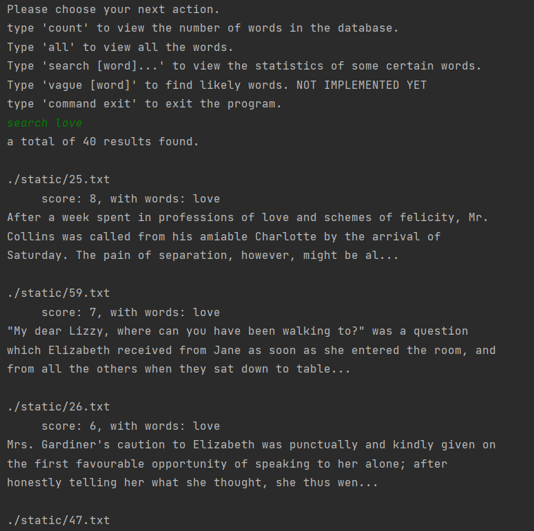

# simple-implementation-mapreduce-invertedindex-v2

 A simple implementation of mapreduce by creating the inverted index 
 of each chapter of Jane Austen's novel Pride and Prejudice. 
 Version 2, in dev, 2022/2/15.

It simulates the process of mapreduce to produce the inverted indexes of 
that novel. A simple searching engine is also implemented to search through
those indexes.

In general, this project contains 4 parts: the preprocessing, the indexing,
the refining and the small search engine. It is a complete overhaul of the 
V1 version and adds more functionalities.

### Preprocessing

It splits the novel by chapters.

### Indexing

Consisting of 2 parts, the manager and the workers / collectors. There is 1 manager
and multiple workers (by default of this project 8).

Each manager and worker is a go routine; managers and workers communicate through channels.
(using defined message type)

The manager first allocate tasks to each worker (to ask them to create inverted indexes for
certain chapters / files). Then, it asks some workers to submit their work and sends these work
to the other half workers to combine those inverted indexes. 
The previous workers are then dismissed (offline). When there is only 1 worker left, 
the manager asks that worker to sort the inverted indexes and save them onto disk as a JSON file.

There is a priority queue deciding which worker to perform the next action. 
A dismissed worker would not be pushed back to the queue, so the size of the 
priority queue does not increase in general, and thus it has a fixed max size.
Basically, the priority queue here is a minimum heap, and the worker with the 
slightest workload (or more exactly, the approximate amount of data) will be 
popped out each time. This can guarantee load balance among workers, as well
as minimize the amount of data traffic when workers are submitting their work.

*the workload or the approximate amount of data is based on the total number of KBs 
a worker has received.

The manager sends different kinds of messages to the workers to assign different
tasks. The worker only sends 2 kinds of messages back: one is when submitting their
work, the other one is when finishing sorting and saving data onto disk (which also
stops the manager and the whole indexing process).

All the workers have their own channel for receiving exclusive commands from the
manager; but their share the same channel for sending data / messages to the manager.
The initial patches of jobs from the user are also sent to the manager through the
shared channel.

### Refining

For now，it only creates snapshots. In the future, the Trie tree for vague searching
or the dictionary of all the related words should go here.

### Search Engine

This is a small search engine supporting searching for a multiple set of words.
It loads multiple JSON files from the disk and stores them in memory. It basically
uses map structures to speed up its performance.

The result will show the name of the chapter / filename containing at least one 
of these words and the total frequency of the words in the chapter, along with
a snapshot of the content of the chapter (the few starting sentences of the 
chapter).

Vague searching is not implemented yet. Also, currently, modification of the JSON
files by the search engine is not allowed.

#### Example

Here is an example of the command-line output：

    

### Other

The Jane Austen's novel is in the "static" folder, along with seperated
chapters. The JSON files are also in there.

The novel is from online source here: 
https://github.com/laumann/ds/blob/master/hashing/books/jane-austen-pride-prejudice.txt

Most paths and common constants are in the "common" package. Others are in each
different packages and are exclusively used by these packages.

To run the project, simply run the main file. Reuse the codes in the comments as 
needed.

### Todo

1. vague search: e.g. auto-correction for typo and suggests related search.
   (this may be achieved by building a Trie tree, calculating words with 
    same characters but in different sequences, or holding a dictionary of 
    all the related words, e.g. abate and abatement)
2. concurrent in sorting (in indexing) and searching (for the search engine).
3. this V2 version assumes that no worker / collector will down due to accident,
    which is not usually the case in reality. In the future, the manager and the
    workers should communicate with each other more actively to ensure each other
    to be functional. For example, there should be a different set of channels 
    through which the two sides periodically and concurrently send signals. 
    If a timeout or silence is detected in these concurrent channels, the manager
    should reallocate the unfinished jobs of the worker among other still-functional
    workers; this may be achieved by using a log 
    (similar to what it is in a database system).
4. there are too many structures in the codes and probably some of them is redundant.
    e.g., the common.NativeRecord and common.NativeRecords. Try to replace them 
   simply with common.Record and common.Records instead in a V3 version.
